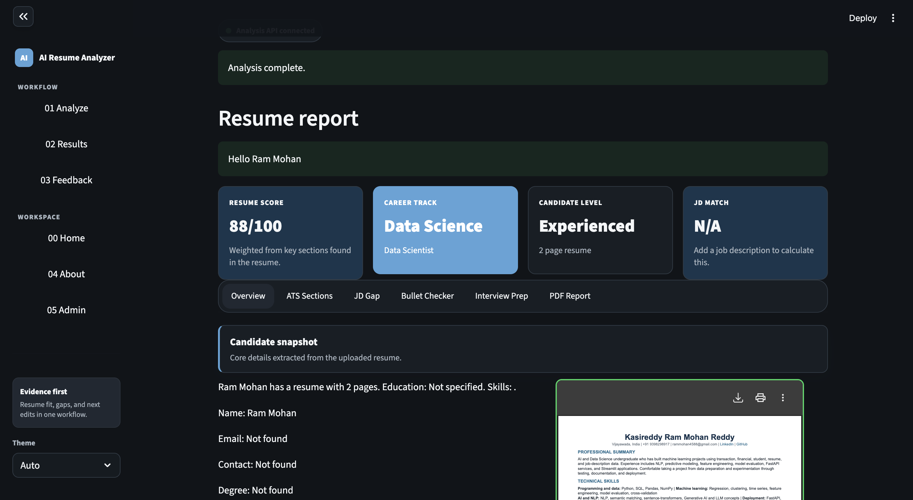
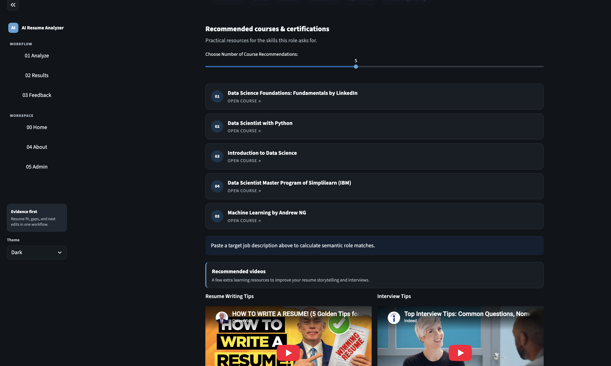
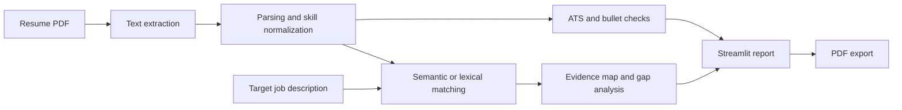

# AI Resume Analyzer

[](https://www.python.org/)
[](https://streamlit.io/)
[](LICENSE)
[](#testing)
[](#testing)

AI Resume Analyzer is a portfolio-grade Streamlit application and HTTP API that compares a resume with a target job description. It combines deterministic parsing, ATS-style checks, optional semantic matching, evidence-backed requirement mapping, improvement guidance, and downloadable PDF reporting.

The application is designed as a decision-support tool. Its scores and suggestions help candidates review a resume; they do not reproduce a specific employer's ATS or guarantee an interview.

## Screenshots





## Highlights

- Parses PDF resumes and recovers contact details, education, sections, and skills.
- Scores expected resume sections and groups results into readable ATS categories.
- Compares resumes with job descriptions using embeddings when available and deterministic lexical fallbacks otherwise.
- Maps prioritized JD capabilities to exact supporting resume lines and reports evidence coverage.
- Categorizes missing signals across skills, tools, domain knowledge, and evidence.
- Reviews bullet quality and suggests stronger, outcome-oriented phrasing.
- Generates technical, project, and behavioral interview-practice questions from the JD.
- Exports a PDF analysis report.
- Stores local analytics in SQLite or connects to PostgreSQL for shared deployments.
- Exposes the analysis workflow through a versioned JSON API.

## How it works



Semantic matching uses `sentence-transformers/all-MiniLM-L6-v2` when the optional dependency is installed. If the model cannot load, the application falls back to deterministic matching so the main workflow remains available.

## Architecture

```text
.
├── app.py                         # Streamlit entry point
├── backend/app/
│   ├── api/server.py              # Versioned HTTP API
│   ├── core/                      # Parsing, matching, scoring, and reports
│   ├── models/                    # Domain and persistence models
│   ├── schemas/                   # Request and response contracts
│   └── services/                  # Analysis use cases
├── frontend/
│   ├── app.py                     # Frontend composition
│   ├── api_client.py              # Backend client
│   ├── components/                # Report and navigation UI
│   ├── pages/                     # Candidate, admin, feedback, and about pages
│   └── services/                  # PDF parsing and storage
├── tests/                         # Unit, architecture, and API integration tests
├── requirements/                  # Optional semantic and development extras
├── Dockerfile
├── nixpacks.toml
└── pyproject.toml
```

The frontend and backend are intentionally separate processes. The frontend calls the API through `BACKEND_API_URL`, which defaults to `http://127.0.0.1:8001`.

## Getting started

### Prerequisites

- Python 3.11 or newer
- `pip` and `venv`

### Installation

```bash
git clone https://github.com/ramu-knightOps/Ai_Resume_Analyzer.git
cd Ai_Resume_Analyzer

python3 -m venv .venv
source .venv/bin/activate
pip install -r requirements.txt
pip install -e .
```

Install the optional embedding model integration:

```bash
pip install -r requirements/semantic.txt
```

Install development and coverage tools:

```bash
pip install -r requirements/dev.txt
```

## Configuration

Copy the example environment file:

```bash
cp .env.example .env
```

| Variable | Required | Purpose |
|---|---:|---|
| `BACKEND_API_URL` | No | API base URL used by the Streamlit frontend |
| `SQLITE_DB_PATH` | No | Local SQLite path; defaults to `data/resume_analyzer.db` |
| `DB_HOST`, `DB_PORT`, `DB_NAME`, `DB_USER`, `DB_PASSWORD` | No | PostgreSQL connection settings; provide the complete set |
| `HF_TOKEN` | No | Higher-rate Hugging Face model downloads |
| `ADMIN_USERNAME`, `ADMIN_PASSWORD` | No | Single admin login |
| `ADMIN_CREDENTIALS` | No | Comma-separated `username:password` admin pairs |

Never commit `.env`, `.streamlit/secrets.toml`, uploaded resumes, or local database files. They are excluded through `.gitignore`.

## Running locally

Start the API in the first terminal:

```bash
source .venv/bin/activate
python -m backend.app.main
```

Start Streamlit in a second terminal:

```bash
source .venv/bin/activate
streamlit run app.py
```

Open `http://localhost:8501`. The API listens on `http://127.0.0.1:8001` by default.

The helper scripts launch each process independently:

```bash
bash start-backend.sh   # API
bash start.sh           # Streamlit frontend
```

## API

| Method | Endpoint | Description |
|---|---|---|
| `GET` | `/api/v1/health` | Service health check |
| `POST` | `/api/v1/analyses` | Complete resume and JD analysis |
| `POST` | `/api/v1/analyses/bullet-quality` | Bullet-quality review |
| `POST` | `/api/v1/analyses/jd-gap` | Categorized JD gap analysis |
| `POST` | `/api/v1/analyses/interview-prep` | Interview-question generation |
| `POST` | `/api/v1/reports/pdf` | PDF analysis report |

Example:

```bash
curl -X POST http://127.0.0.1:8001/api/v1/analyses \
  -H "Content-Type: application/json" \
  -d '{
    "candidate_name": "Asha",
    "resume_text": "Skills: Python, SQL. Built a FastAPI service for analytics reporting.",
    "resume_skills": ["Python", "SQL", "FastAPI"],
    "job_description": "Seeking a data scientist with Python, SQL, model evaluation, and API deployment experience."
  }'
```

## Testing

Run the complete suite and enforce the project coverage threshold:

```bash
coverage run --source=backend.app -m unittest discover -s tests -v
coverage report -m --fail-under=80
```

Current verified result:

- 35 tests passing
- 94% backend coverage
- Coverage includes parsing, matching, ATS scoring, evidence mapping, API behavior, PDF fallback, and package architecture

## Deployment

The repository includes `Dockerfile` and `nixpacks.toml` definitions suitable for container or Railway-style deployments.

Because the frontend and API are separate processes, production deployment should run them as two services:

1. Backend service: `bash start-backend.sh`
2. Frontend service: `bash start.sh`
3. Frontend environment: set `BACKEND_API_URL` to the public backend URL

Use PostgreSQL instead of local SQLite when multiple instances or persistent shared analytics are required.

## Privacy and responsible use

Resumes contain personal information. For non-local deployments:

- Use TLS and access controls.
- Keep secrets in the deployment platform's secret manager.
- Define retention and deletion rules for uploaded resumes and analysis records.
- Avoid logging raw resume text or credentials.
- Treat all match scores as guidance, not hiring decisions.
- Review generated suggestions before using them in an application.

## Limitations

- PDF extraction quality depends on the source document's structure and embedded fonts.
- Keyword and embedding similarity do not prove proficiency or job readiness.
- The tool does not emulate proprietary ATS ranking algorithms.
- Suggested bullet rewrites require human verification; users should never add unsupported metrics.
- Semantic results depend on the quality and specificity of both the resume and JD.

## Contributing

Issues and focused pull requests are welcome. Before submitting a change:

1. Keep analysis logic deterministic where practical.
2. Add or update tests for behavior changes.
3. Run the full test and coverage commands.
4. Do not commit resumes, credentials, databases, model caches, or generated reports.

## License

This project is available under the [MIT License](LICENSE). The license permits use, copying, modification, distribution, sublicensing, and sale, provided the copyright and permission notice are retained.

The repository retains the original copyright notice:

> Copyright (c) 2022 Deepak Padhi

See [LICENSE](LICENSE) for the complete terms and warranty disclaimer.
